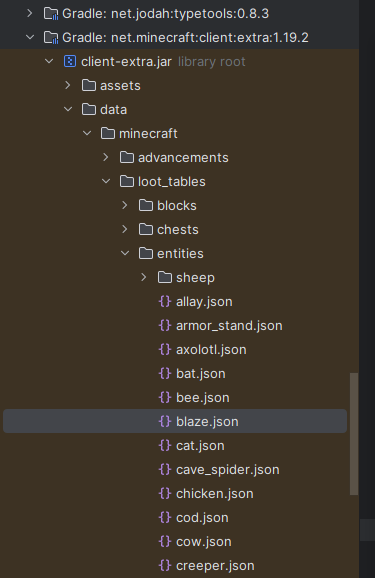

### Mod Resources
- Miro Board: https://miro.com/app/board/uXjVPvycxJQ=/
- Spell Sheet: https://docs.google.com/spreadsheets/d/1o0MyG9ok5Csf8_-77f-qH3VqOu6NtiuYcBb_SzDmA3M/edit#gid=1973083805
- Trello: https://trello.com/b/yzpLtJpQ/spell-book-mod
- Github: https://github.com/iron431/irons_spellbooks

### Gradle
- https://github.com/BluSunrize/ImmersiveEngineering/blob/7d49b2aa24b5759931db0220ecffec447dc854b9/build.gradle
- https://github.com/MightyPirates/OpenComputers/blob/de8f207f3bc4ed5fc14c8e163263f3541bf30c2a/build.gradle#L30

### Good 1.18 tutorials
- https://www.mcjty.eu/docs/1.18/
- https://github.com/McJty/TutorialV3/tree/98b824b6adfb318c19fe96ae41f504ade7d40dcf/src/main/java/com/example/tutorialv3/manasystem
- https://github.com/Tutorials-By-Kaupenjoe/Forge-Tutorial-1.18.1/tree/main/src/main/java/net/kaupenjoe/tutorialmod
- https://moddingtutorials.org/1.18.2/environment-setup
- Entity creation in blockbench https://www.youtube.com/watch?v=XBIXn7s-fMo

### Testing
- Testing Example on a Forge pull request: https://github.com/]MinecraftForge/MinecraftForge/pull/8918/files#diff-fae470ebbd5b00cd8bcd73d47b8cf766f3e19a42b3dc409440f9c884bbb41758
- Curios Github tests: https://github.com/TheIllusiveC4/Curios/tree/1.18.x/src/test/java/top/theillusivec4/curiostest

### Access Transformers accesstransformer.cfg
You can get the SRG names using one of the following methods
- Via Linkie https://linkie.shedaniel.me/mappings
- Via ForgeBot/K9
- Via grepping/searching build\createMcpToSrg\output.tsrg

### Documentation Site
- General
  - https://jekyllrb.com/docs/continuous-integration/github-actions/
  - https://jekyllrb.com/docs/themes/
  - https://idratherbewriting.com/documentation-theme-jekyll/mydoc_publishing_github_pages.html
- Theme
  - https://github.com/chrisrhymes/bulma-clean-theme/#installation
- Github Docs
  - https://github.com/github/pages-gem
  - https://docs.github.com/en/pages/setting-up-a-github-pages-site-with-jekyll/about-github-pages-and-jekyll

### Inventory tabs
- Enchanted book example - EnchantedBookItem.fillItemCategory

### JEI
- Their plugin for vanilla - https://github.com/mezz/JustEnoughItems/tree/1.12/src/main/java/mezz/jei/plugins/vanilla

### Capabilities
- https://github.com/mickelus/tetra/search?q=capability/
- https://github.com/Shadows-of-Fire/Apotheosis/search?q=capability
- https://github.com/TheGreyGhost/MinecraftByExample/search?q=getShareTag
- Player Cap Syncing
  - https://github.com/Fuzss/puzzleslib/blob/1.19/Forge/src/main/java/fuzs/puzzleslib/capability/data/ForgePlayerCapabilityKey.java
  
### Mixins
- https://gist.github.com/TelepathicGrunt/3784f8a8b317bac11039474012de5fb4

### Item Stack
- https://www.youtube.com/watch?v=edcpW1zzUfk

### Creating entities / Blockbench
- https://www.youtube.com/watch?v=VlUwLXkwb2c
- https://www.youtube.com/watch?v=kxzZ-oJKjcY

### Other Random Links
- https://www.youtube.com/watch?v=prqMxqUtj-0
- Teleport: https://moddingtutorials.org/1.19.2/advanced-items/
- Loading values from config: https://www.youtube.com/watch?v=QN9jq3_V-I8

### Particles
- https://forge.gemwire.uk/wiki/Particles
- https://www.youtube.com/watch?v=DM69u76tXMI

### Structures
- Great jigsaw information: https://www.youtube.com/watch?v=BIa_gqc93ok
- Build school: https://www.youtube.com/watch?v=u9mJcQ79AQ8&list=PLU2851hDb3SHAwj82FZCIkjuQ4d3FwZFB
- https://github.com/TelepathicGrunt/StructureTutorialMod/tree/1.18.2-Forge-Jigsaw
- https://www.mcjty.eu/docs/1.18/ep5
- Getting resource registry issue
  - Template Pool: https://www.youtube.com/watch?v=TD1lDaw4zfY
- Great Structure Resouce: https://github.com/TelepathicGrunt/StructureTutorialMod
- Structure 
  - Structure Blocks go in the NW corner
  - Air: Blue
  - Void: Pink

### World Edit
- Cylinders https://www.youtube.com/watch?v=FZj4-Y2qvm8
- Fill and Hollow https://www.youtube.com/watch?v=_dJBsfhMX9U

### Sounds
- https://forge.gemwire.uk/wiki/Sounds

### Cool Building Mod
- https://www.reddit.com/r/feedthebeast/comments/102jpqk/i_ported_the_mighty_architect_to_fabric_1192/

### Gradle Licnese Header Example
- https://github.com/TerraFirmaCraft/TerraFirmaCraft

### Multi/Double Block 
- https://mcmodhelp.fandom.com/wiki/Multi-Texturing_Blocks
- General Custom Block: https://www.youtube.com/watch?v=NqgR9vt7P5k

### Rendering
- OpenGL Blending used by Minecraft: https://registry.khronos.org/OpenGL-Refpages/gl4/html/glBlendFuncSeparate.xhtml

### Geckolib
- https://www.youtube.com/watch?v=62GMA9Yg938
- https://www.youtube.com/watch?v=3srLEdFTgVI
- Attack Animation: https://youtu.be/_Ob2XCsfboI?t=120

###
- Hit Detection
    - https://github.com/ZsoltMolnarrr/BetterCombat/tree/1.18.2/forge
    - https://github.com/ZsoltMolnarrr/BetterCombat/blob/74ccd5f7092b932b26462f27e0ea383acc1a92ae/common/src/main/java/net/bettercombat/client/collision/TargetFinder.java

### Helpful commands
```shell
/attribute @p irons_spellbooks:max_mana base set 10000
/attribute @p irons_spellbooks:cooldown_reduction base set 10
/attribute @p irons_spellbooks:cast_time_reduction base set 10
/setblock ~ ~ ~ irons_spellbooks:inscription_table
/data get entity @s SelectedItem
/data get entity @s ForgeCaps
/data get entity @s Pos
/effect give @s resistance 10000 4 true
/summon minecraft:creeper ~1 ~ ~1 {NoAI:1b}
/attribute Dev minecraft:generic.movement_speed get
/effect give Dev irons_spellbooks:root
/summon irons_spellbooks:summoned_polar_bear ~ ~ ~ {Passengers:[{id:"irons_spellbooks:citadel_keeper"}]}
/fill ~-15 ~-1 ~-15 ~15 ~-7 ~15 quartz_block

/give @s minecraft:iron_chestplate{AttributeModifiers:[{AttributeName:"irons_spellbooks:blood_slash_resist",Slot:"chest",Amount:.5,Operation:1,UUID:[I;109,10810,109635,18212]}]} 1
/give @s minecraft:iron_chestplate{AttributeModifiers:[{AttributeName:"irons_spellbooks:cooldown_reduction",Slot:"chest",Amount:.2,Operation:1,UUID:[I;109,10810,109635,18212]}]} 1
/give @s minecraft:iron_chestplate{AttributeModifiers:[{AttributeName:"irons_spellbooks:max_mana",Slot:"chest",Amount:.2,Operation:1,UUID:[I;109,10810,109635,18212]}]} 1
```

### Give Generator
- https://mapmaking.fr/give1.16/

### Offline Server/Client
- Running the dedicated server in intellj
  - In ./run/eula.txt set "eula=true"
  - In ./run/server.properties set "online-mode=false"
  - In IntelliJ run the runServer task
- Connecting as a specific user to the offline server
  - Edit the run-client gradle task and edit the CLI Arguments.  Append --username=YourOfflineUsernameGoesHere
  - In IntelliJ run the runClient task

### Notes
- Block Overlay Example: https://github.com/Hexeption/DarkForge/blob/master/src/main/java/uk/co/hexeption/darkforge/mod/mods/render/BlockOverlay.java
- Nice rendering library: https://github.com/maruohon/malilib
- https://github.com/TobyNguyen710/kyomod/blob/56d3a9dc6b45f7bc5ecdb0d6de9d201cea2603f5/Mod/build/tmp/expandedArchives/forge-1.19.2-43.1.7_mapped_official_1.19.2-sources.jar_b6309abf8a7e6a853ce50598293fb2e7/net/minecraft/world/entity/projectile/ShulkerBullet.java
- https://github.com/maximumpower55/Aura/blob/1.18/src/main/java/me/maximumpower55/aura/entity/SpellProjectileEntity.java
- https://github.com/CammiePone/Arcanus/blob/1.18-dev/src/main/java/dev/cammiescorner/arcanus/common/entities/MagicMissileEntity.java#L51
- https://github.com/maximumpower55/Aura
- Projectile.lerpMotion is also a decent reference
This method appears to set the movement delta (change in position) of the projectile, as well as its rotation based on the movement delta.
The method takes three parameters: p37279, p37280, and p37281, which represent the movement delta in the x, y, and z directions, respectively.
The method first sets the movement delta using the setDeltaMovement method. It then checks if the xRotO and yRotO fields are equal to 0.0. If they are,
it calculates the pitch and yaw (rotation around the x and y axes, respectively) based on the movement delta using the atan2 function. It then sets the
pitch and yaw of the projectile using the setXRot and setYRot methods, and stores the pitch and yaw in the xRotO and yRotO fields, respectively. Finally,
it calls the moveTo method to update the position and rotation of the projectile.

### Recipes
- https://forge.gemwire.uk/wiki/Tags

